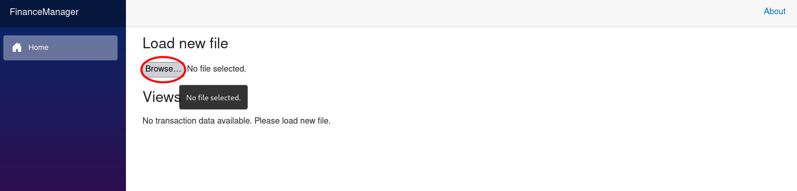
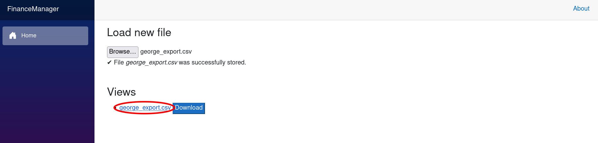
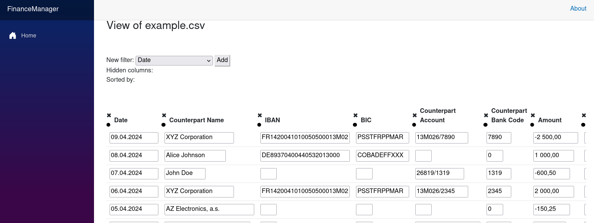
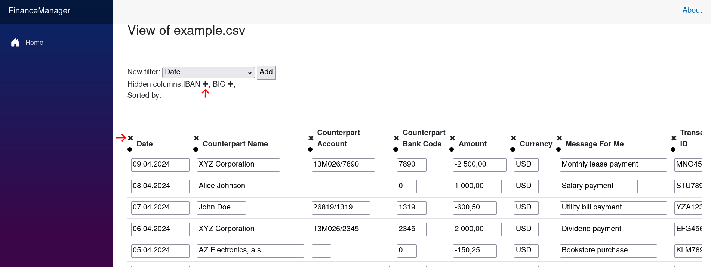
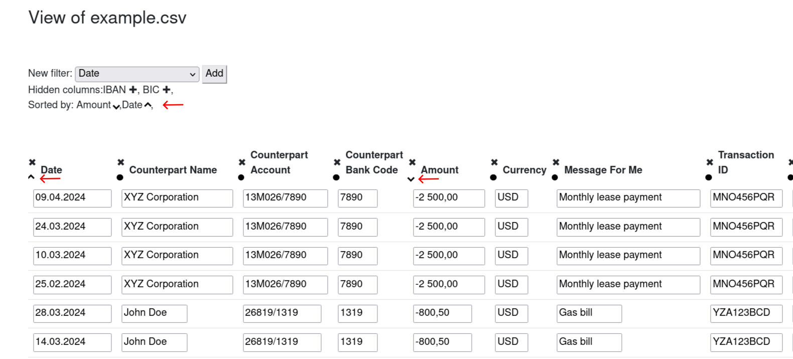
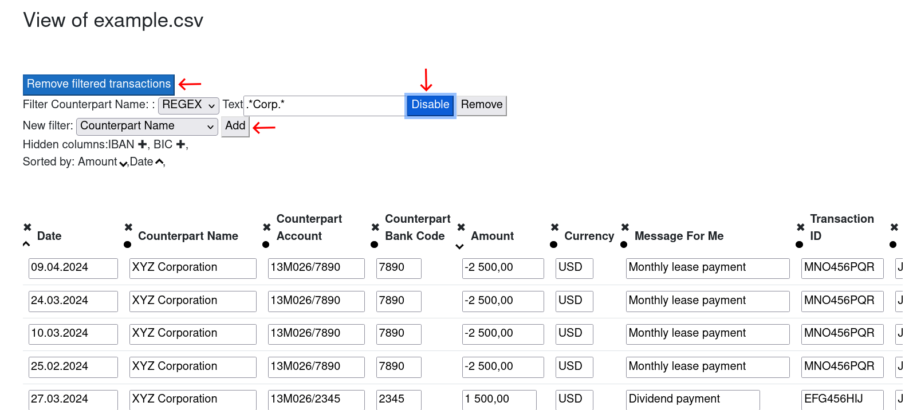
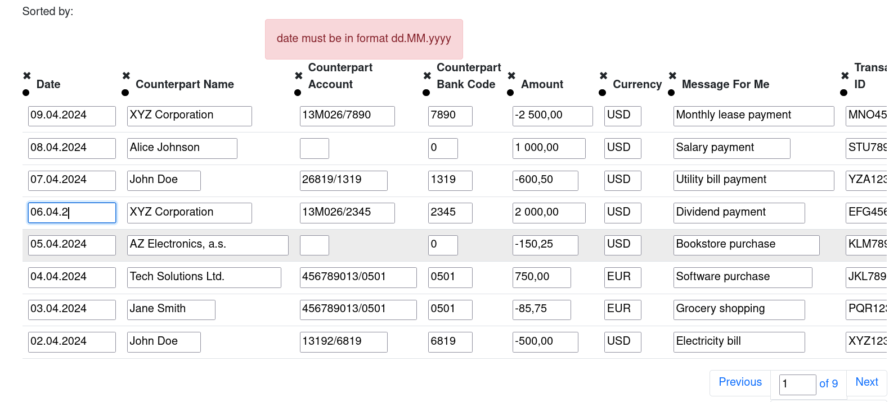
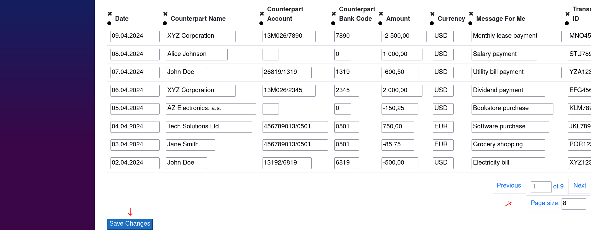

### About

This project was originally done as my individual work required for the completion of a c# university course, that I took.
I was my first Blazor app, and also my first experience with ASP.NET Core.

### Goal

The goal was to create simple application for personal finance management 
and my personal was also to get an initial experience Blazor app development.

### Result

Created application met the desired goals, but it is far from possible use in reality, 
mainly due to frontend issues and and some missing features.

### Overview
When the app as opened the home page look like this:


Here we can load bank transaction data as a csv file, using the *load* button.
Only one format of the csv file is supported now,
the csv file should look similar to this:
```
"date","counterpart name","IBAN","BIC","counterpart account","counterpart bank code","amount","currency","message","transaction ID","owner name","owner account number"
"10.04.2024","Restaurant","","","","0","-300,75","USD","Repayment for dinner","GHI123JKL","John Doe","567890/1234"
"09.04.2024","XYZ Corporation","FR1420041010050500013M02606","PSSTFRPPMAR","13M026/7890","7890","-2 500,00","USD","Monthly lease payment","MNO456PQR","John
"08.04.2024","Alice Johnson","DE89370400440532013000","COBADEFFXXX","","0","1 000,00","USD","Salary payment","STU789VWX","John Doe","567890/1234"
...
```

After the csv file is loaded we get link for a view of the file and download button:


The download button will save the transactions to clients side as scv file.
After clicking to the file name, we are redirected to the file view:


The most of the functionality lies in the data grid displaying the loaded transaction data.
The data grid has following functionalities:

#### Hide/Display column

By clicking on the cross symbol on the left of a column name, the column is hidden.
Name of hidden columns are displayed above the grid, 
and can be displayed again by clicking in the plus symbol
next to the name of hidden column.


#### Sorting transactions

Transactions are sorted based on values in a column
by clicking on the dot symbol next to the name of the given column.
The symbol changes to indicate the sorting direction. By clicking on the symbol again
you toggle between sort directions:
- Descending direction - symbolized by upward arrow
- Ascending direction - symbolized by downward arrow
- No direction, i.g. no sort on given column, symbolized by dot symbol

Above the grid can be seen line indicating on which columns 
and in what order are the transactions sorted.
Following image illustrates situation where the transaction are sorted
primarily on "Amount" column in ascending order,
secondary on "Date" column in descending order.


#### Filtering transactions 

You can also filter the transaction, so only those transactions are displayed
which satisfies conditions given by filters.
Above the grid, there is a form for adding new filter, 
enabling to choose which column to make the filter on.
When the filter is added, you can choose the filter value and comparison method.
Usually numerical values and dates are compared by <, <=, ==, etc.
String values can be compared by REGEX.
After the filter is applied only transaction satisfying the comparison or REGEX are displayed.
If you decide you want to work with only filtered data, you can click on
"remove filtered transactions" button, by which all out filtered transactions will be dropped for good.


#### Modifying the data

You can modify data directly in the grid.
The grid validates the data format and will display an error message,
when invalid format is used.



#### Pagination a saving the changes

At the bottom of the page there is oversimplified pagination 
and a button to save the changes made in the view.
After changed are saved, you can download the modified file
on homepage using the download button next to the file name.


### IMPORTANT!

The application stores everything as a part of a session.
If you refresh the page, you will lose all your data.
